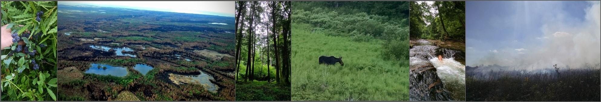

```{r message=FALSE, warning=FALSE, include=FALSE}
library(readr)
library(ggplot2)
library(plotly)
library(RColorBrewer)
library(scales)
library(leaflet)
library(dplyr)

```


```{r}
knitr::opts_chunk$set(echo=FALSE, message=FALSE, warning=FALSE)
```

### Welcome! 

#### This Dashboard...

was built by me, [Randy Swaty](mailto:rswaty@tnc.org) as springboard for learning about the major ecosystems of Michigan, how they've changed, and a little bit about how *you* view them.  

I am ecologist who studies ecosystems from large to very small.  I also love [working with students!](https://rswaty.github.io/TheCDL/){target='blank'}   

As you explore, look for answers to these questions:

* Are you a lumper or a splitter?  Why does that matter?
* Of the ecosystems presented here, what percentage of Michigan was/is covered by wetlands? Oh and what is an "ecosystem"?
* How much fire was there in Michigan historically in these major ecosystems?
* Which ecosystems do you think you've seen?  Which ones would you like to see next?
* Can you find the circle packing chart? 

<br>


#### 

```{r, echo=FALSE, fig.width=12, fig.height=3} 

```
<br>
Blueberries, aerial view of Duck Lake Fire in Luce county Michigan, regenerating maples in light gap, moose (!), happy kid.  All photos by Randy Swaty.


### Michigan (from 423 miles away!) {data-commentary-width=400}


```{r echo=FALSE, message=FALSE, warning=FALSE}
htmltools::tags$iframe(title = "My embedded document", src = "m.html", frameborder = "0", width = "100%", height="500")
```

<br>

*** 

**From space...**

At first glance you may see just blue and green with some gray lines.  Look a little closer and you'll start to see some clouds, especially at the base of the Keweenaw Peninsula of the Upper Peninsula (U.P).  Keep looking-you'll see lighter greens and darker greens.  What does that mean?  What time of year do you think these satellite images are from?  Zoom in a little.  Try to find a farm, a city, maybe even a wetland (hint: look to the eastern U.P.).  Look closely at the bottom of the map.  Can you find the name of the satellite?  There's a [Wiki page about it!](https://en.wikipedia.org/wiki/GeoEye-1){target='blank'} To learn more about looking at satellite images go to the [earth observatory page.](https://earthobservatory.nasa.gov/features/ColorImage){target='blank'} 


 
* The vegetation maps you'll see are comprised of 572,176,275 30m x 30m squares we call "pixels".  
* Each pixel was labeled by scientists with the [LANDFIRE](www.landfire.gov){target='blank'} program.  
* Michigan's major ecosystems presented here cover 30,853,575 acres of Michigan (a little over half the state...there are many more ecosystems!)
* Before moving on, stop and think. Are you a lumper or a splitter? Take [this quiz (will be downloaded when you click)](./Lumper-Splitter (1).docx){target='blank'} to find out, then move to the next page to see why it matters. 


### Looking back {data-commentary-width=400}

```{r BpSchart, echo=FALSE, message=FALSE, warning=FALSE}
bpsTen <- read_csv("bpsTen.csv")

bpsCol <- rgb(bpsTen$R, bpsTen$G, bpsTen$B, maxColorValue=255)

bpsTen$HexColor <- bpsCol #Add new HexColor column to dataframe


p1 <-
  ggplot() +
  geom_col(data=bpsTen, aes(x=reorder(bpsName, Acres), y=Acres, fill= bpsTen$HexColor)) +
  coord_flip() +
  scale_fill_identity() +
  scale_y_continuous(labels = comma) +
  labs(title="Historical ecosytems of Michigan", subtitle="Top 10 most prevelent ecosystems just prior to European Settlement") +
  xlab("") +
  ylab("Acres") +
  theme(legend.position='none') 

p1 <- ggplotly(p1, tooltip=c("bpsName", "Acres")) 

p1

```

*** 
**The Ecosystems**

If you took the Lumper-Splitter quiz you already have an understanding about how different people classify and name ecosystems. Note words in the ecosystem names on the chart below-words like "barrens", "woodlands", "forest", (those first three are related to an increase in tree canopy coverage.) "swamp", "mesic", and "peatlands" (you know what "dry" means already!).  Hit up Google to see what you find.  I used LANDFIRE data for all the charts and maps, but feel that [Michigan Natural Features Inventory (MNFI)](https://mnfi.anr.msu.edu/){target='blank'}contains more region-specific resources for learning about these ecosystems for Michigan.  I've listed some dominant species for each ecosystem and linked the relevant MNFI descriptions below. See their [key](https://mnfi.anr.msu.edu/communities/key) for more information, and to explore all of Michigan's ecosystems!

* [Northern Hardwood Forests-Hemlock: sugar maple, eastern hemlock, American beech](https://mnfi.anr.msu.edu/communities/description/10687/mesic-northern-forest){target='blank'}
* [Beech-Maple Forest](https://mnfi.anr.msu.edu/communities/description/10684/mesic-southern-forest){target='blank'}
* [Alkaline Conifer-Hardwood Swamp](https://mnfi.anr.msu.edu/communities/description/10656/hardwood-conifer-swamp){target='blank'}
* [Northern Pine(-Oak) Forest](https://mnfi.anr.msu.edu/communities/description/10689/dry-northern-forest){target='blank'}
* [Dry-Mesic Oak Forest and Woodland](https://mnfi.anr.msu.edu/communities/description/10685/dry-mesic-southern-forest){target='blank'}
* [Pine-Hemlock-Hardwood Forest](https://mnfi.anr.msu.edu/communities/description/10688/dry-mesic-northern-forest){target='blank'}
* [Oak Barrens](https://mnfi.anr.msu.edu/communities/description/10693/oak-barrens){target='blank'}
* [Boreal Acidic Peatland Systems(note-please review all peatland types)](https://mnfi.anr.msu.edu/communities/key){target='blank'}
* [White Spruce-Fir-Hardwood Forest](https://mnfi.anr.msu.edu/communities/description/10690/boreal-forest){target='blank'}
* [Floodplains](https://mnfi.anr.msu.edu/communities/description/10658/floodplain-forest){target='blank'}


### Historical Map {data-commentary-width=400}


```{r, echo=FALSE, fig.height=7} 
knitr::include_graphics("bps.JPG")
```

*** 
**Historical Ecosystems of Michigan**

<br>

What patterns do you see? This map represents where we think the major ecosystems of Michigan would have been just prior to European settlement. At this time native Americans were managing the vegetation, largely through fire. Another thing to explore: Native Land Digital’s map of indigenous territories.  Explore [Native Land Digital's map of indigenous territories](https://native-land.ca/){target='blank'} to learn more about which tribes were where.

To make this dataset ecologists generally used soil types, climate, geology and elevation to understand why each ecosystem occurred where it did. Then they used datasets that represent those factors to predict where the ecosystems would have been. For example, if an ecosystem was known to occur on well- drained, infertile soils in the coldest parts of the state, ecologists would look for those areas to place that ecosystem (way oversimplified!).   

I purposely did not add a zoom function to this map (well, you can use the zoom on your browser!).  Why you ask? One reason is that I don't know how to yet :).  Another, and more important reason is that I wanted you to get a macro or satellite view of things.  This is an important perspective.  For now enjoy the view!  Also, while it may be a bit frustrating to not have a legend, we know that you learn and remember more if you exercise your brain a little bit.  I did make the colors of the previous chart the same as the colors on the map.  Toggle back and forth, remember the colors and see what you can find!

Remember me asking about historical disturbances like fire?  Explore this [chord diagram](distChord .html){target='blank'} and do a little addition noting that I think that the acres of fire (for example) depicted in the chord diagram are impressive, the numbers are low.  I am certain there was more fire, and definitely more insect damage.  Want to help me improve the models we used?  Data to power the chart is from the ["Biophysical Settings" Models developed by LANDFIRE.](https://www.landfire.gov/bps-models.php){target='blank'}


### Ecosystems Today {data-commentary-width=400}

```{r EVTchart, echo=FALSE, message=FALSE, warning=FALSE}
evtTen <- read_csv("evtTen.csv")

evtCol <- rgb(evtTen$R, evtTen$G, evtTen$B, maxColorValue=255)

evtTen$HexColor <- evtCol #Add new HexColor column to dataframe


evt <-
  ggplot() +
  geom_col(data=evtTen, aes(x=reorder(evtName, Acres), y=Acres, fill= evtTen$HexColor)) +
  coord_flip() +
  scale_fill_identity() +
  scale_y_continuous(labels = comma) +
  labs(title="Current ecosytems of Michigan", subtitle="Top 10 most prevelent modern ecosystems") +
  xlab("") +
  ylab("Acres") +
  theme(legend.position='none') 

evt <- ggplotly(evt, tooltip=c("evtName", "Acres")) 

evt

```

*** 

**Much of Michigan has been converted to agriculture!**
Here I calculated the acres for the 10 most prevalent "ecosystems" in Michigan as of the latest data, ca2016.  A couple questions for you:

* Are agricultural lands ecosystems?  Why or why not?  All crops are not the same...are the impacts of pastures the same as row crops such as corn?
* Which ecosystems were most converted to agriculture?  Explore the map [here,](agDev.jpg){target='blank'} and/or check out the "Sankey Diagram" on the next tab.


To explore conversion for the coterminous (what does *that* mean?) United States, explore this [web app](https://randy-swaty.shinyapps.io/EcosystemExplorerRS/){target='blank'} developed by  Marquette, MI Mathurin Gagnon native (big data-this may take a few moments to load).


### Change {data-commentary-width=400}

```{r echo=FALSE, message=FALSE, warning=FALSE, fig.width=12}

htmltools::tags$iframe(title = "My embedded document", src = "snky.html", frameborder = "0", width = "100%", height="500")
```

***
**Change Happens**

This is a Sankey Diagram.  On the left are the amounts and names of the historical ecosystems.  On the right are the most prevalent modern ecosystems.  The grey bands represent transitions from one to another.  Hover your mouse cursor over the different areas of the chart to build a picture in your mind about which ecosystems have transitions to which.  Some questions to think about:

* Which ecosytems were most converted to row crops?
* Which ecosystems have had the least amount of conversion?
* What might "close grown crop" be?

To dig (ha ha) deeper into forest conversion world wide, and to even check out really cool global tree cover maps read [this paper](https://www.sciencemag.org/news/2018/09/scientists-reveal-how-much-world-s-forests-being-destroyed-industrial-agriculture){target='blank'} then explore [these maps](https://www.globalforestwatch.org/map/){target='blank'}.

While this dashboard is focused on terrestrial ecosystems, take a minute to explore and think about how conservationists can work with farmers at the interface of [soil and water](https://www.nature.org/en-us/about-us/who-we-are/how-we-work/working-with-companies/companies-investing-in-nature1/conservation-where-soil-and-water-meet/){target='blank'}.  


### Answers, Ideas and about this Dash

**Some answers to the questions on the Welcome tab:**

* Are you a lumper or a splitter? Why does that matter?
    * I can not tell you if you are a lumper or a splitter.  I am more of a lumper myself.  
    * This helps us understand how we view the our surroundings.  On your next walk or ride try to decide when one ecosystem becomes the next.  When does northern hardwoods become pine-hemlock-hardwoods forest?  There is actually a [Wikipedia entry](https://en.wikipedia.org/wiki/Lumpers_and_splitters#:~:text=A%20%22lumper%22%20is%20an%20individual,that%20differ%20in%20key%20ways.){target='blank'} on lumpers and splitters!  
* Of the ecosystems presented here, what percentage of Michigan was/is covered by wetlands? Oh and what is an “ecosystem”?
    * Roughly 25% of Michigan was wetlands.  This has not changed much.  In some areas this percentage is much higher, such as at [Seney National Wildlife Refuge](https://www.fws.gov/refuge/seney/){target='blank'} which is over 80% wetlands!
    * Ecosystem: first, keep your eyes peeled for "eco" things, like an Eco-Boost motor on a truck.  Does that make sense?  "Eco" roughly means "house" in Greek.  To me an ecosystem is a set of organisms interacting with each other and their environment to one degree or another.  National Geographic has a good entry on this term [here](https://www.nationalgeographic.org/encyclopedia/ecosystem/){target='blank'}.
* How much fire was there in Michigan historically in these major ecosystems?
    * A lot.  In the chord diagram I have ~805,000 acres burning annually prior to European settlement.  This does not include all ecosystems!  I figure that roughly 1,200,000 acres burned annually before we started putting them all out, and converting lands.  Today 30,000 acres is about the maximum.  
* Which ecosystems do you think you’ve seen? Which ones would you like to see next?

**Ideas for where you can go next!**

* In person: 
    * [The Nature Conservancy's Michigan Chapter Preserves](https://www.nature.org/en-us/get-involved/how-to-help/places-we-protect/?s=Michigan){target='blank'}
    * [Upper Peninsula Land Conservancy](https://www.uplandconservancy.org/){target='blank'}
    * [Michigan's National Parks](https://www.nps.gov/state/mi/index.htm){target='blank'}
    * [US Fish and Wildlife Service in Michigan](https://www.fws.gov/refuge/michigan_wmd/){target='blank'}
    * [Michigan Department of Natural Resources](https://www.michigan.gov/dnr/){target='blank'}
    
**About the author:**
I am an ecologist with The Nature Conservancy's LANDFIRE Team (learn more about his work [here](https://blog.nature.org/science/2015/05/15/landfire-decade-tool-ecological-restoration-map-data-swaty/){target='blank'}), father of two sons, and lead of the [Conservation Data Lab.](https://rswaty.github.io/TheCDL/){target='blank'}  

**About this dashboard:**
Definitely a "Version 1", written in the programming language R as a "flexdashboard".  I am done.  Oh wait, a little blooper outtake [circle packing chart](cpDist.html){target='blank'} for those fun geeks who made it this far.


