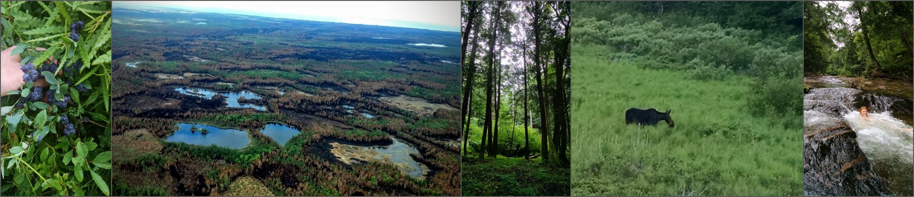

```{r message=FALSE, warning=FALSE, include=FALSE}
library(readr)
library(ggplot2)
library(plotly)
library(RColorBrewer)
library(scales)
library(leaflet)
library(dplyr)

```


```{r}
knitr::opts_chunk$set(echo=FALSE, message=FALSE, warning=FALSE)
```

### Welcome! {data-commentary-width=400}

#### This Dashboard...

was built by Randy Swaty as springboard for learning about the major ecosystems of Michigan, how they've changed, and a little bit about how *you* view them.  As you explore, look for answers to these questions:

* Are you a lumper or a splitter?  Why does that matter?
* Of the ecosystems presented here, what percentage of Michigan was/is covered by wetlands? Oh and what is an "ecosytem"?
* How much fire was there in Michigan historically in these major ecosystems?
* Which ecosystems do you think you've seen?  Which ones would you like to see next?


#### 

```{r, echo=FALSE, fig.width=12, fig.height=3} 

```
<br>
Blueberries, aerial view of Duck Lake Fire in Luce county Michigan, regenerating maples in light gap, moose (!), happy kid.  All photos by Randy Swaty.


### Michigan (from 423 miles away!) {data-commentary-width=400}


```{r echo=FALSE, message=FALSE, warning=FALSE}
htmltools::tags$iframe(title = "My embedded document", src = "m.html", frameborder = "0", width = "100%", height="500")
```

<br>

*** 

**From space...**

At first glance you may see just blue and green with some gray lines.  Look a little closer and you'll start to see some clouds, especially at the base of the Keeweenaw Peninsula of the Upper Peninsula (U.P).  Keep looking-you'll see lighter greens and darker greens.  What does that mean?  What time of year do you think these satellite images are from?  Zoom in a little.  Try to find a farm, a city, maybe even a wetland (hint: look to the eastern U.P.).  Look closely at the bottom of the map.  Can you find the name of the satellite?  There's a [Wiki page about it!](https://en.wikipedia.org/wiki/GeoEye-1){target='blank'} To learn more about looking at satellite images go to the [earth observatory page.](https://earthobservatory.nasa.gov/features/ColorImage){target='blank'} 


* Are you a lumper or a splitter?  Take [this quiz (will be downloaded when you click)](./Lumper-Splitter (1).docx){target='blank'} to find out and to see why that matters. 
* The vegetation maps you'll see are comprised of 572,176,275 30m x 30m squares we call "pixels".  
* Each pixel was labeled by scientists with the [LANDFIRE](www.landfire.gov){target='blank'} program.  
* Michigan's major ecosystems presented here cover 30,853,575 acres of Michigan (a little over half the state...there are many more ecosystems!) 


### Looking back {data-commentary-width=400}

```{r BpSchart, echo=FALSE, message=FALSE, warning=FALSE}
bpsTen <- read_csv("bpsTen.csv")

bpsCol <- rgb(bpsTen$R, bpsTen$G, bpsTen$B, maxColorValue=255)

bpsTen$HexColor <- bpsCol #Add new HexColor column to dataframe


p1 <-
  ggplot() +
  geom_col(data=bpsTen, aes(x=reorder(bpsName, Acres), y=Acres, fill= bpsTen$HexColor)) +
  coord_flip() +
  scale_fill_identity() +
  scale_y_continuous(labels = comma) +
  labs(title="Historical ecosytems of Michigan", subtitle="Top 10 most prevelent ecosystems just prior to European Settlement") +
  xlab("") +
  ylab("Acres") +
  theme(legend.position='none') 

p1 <- ggplotly(p1, tooltip=c("bpsName", "Acres")) 

p1

```

*** 
**The Ecosystems**

* [Northern tallgrass prairie](https://www.nps.gov/tapr/learn/nature/a-complex-prairie-ecosystem.htm){target='blank'}
* [Northern Hardwood Forests](https://en.wikipedia.org/wiki/Northern_hardwood_forest){target='blank'}

etc.

OR...teach them to pick the name apart...what is a "forest" compared to a "savanna"?  Plus showcase some trees?


### Historical Map {data-commentary-width=400}


```{r, echo=FALSE, fig.height=7} 
knitr::include_graphics("bps.JPG")
```

*** 

What patterns do you see?  Use the "Zoom Out" function in your browser to get a little closer.

Remember me asking about historical disturbances like fire?  Explore this [chord diagram](distChord .html){target='blank'}


### Ecosystems Today {data-commentary-width=400}

```{r EVTchart, echo=FALSE, message=FALSE, warning=FALSE}
evtTen <- read_csv("evtTen.csv")

evtCol <- rgb(evtTen$R, evtTen$G, evtTen$B, maxColorValue=255)

evtTen$HexColor <- evtCol #Add new HexColor column to dataframe


evt <-
  ggplot() +
  geom_col(data=evtTen, aes(x=reorder(evtName, Acres), y=Acres, fill= evtTen$HexColor)) +
  coord_flip() +
  scale_fill_identity() +
  scale_y_continuous(labels = comma) +
  labs(title="Current ecosytems of Michigan", subtitle="Top 10 most prevelent modern ecosystems") +
  xlab("") +
  ylab("Acres") +
  theme(legend.position='none') 

evt <- ggplotly(evt, tooltip=c("evtName", "Acres")) 

evt

```

*** 

* For a map of agricultural and urban land uses click [here](agDev.jpg){target='blank'}
* To explore conversion for the coterminous (what does *that* mean?) United States, explore this [web app](https://randy-swaty.shinyapps.io/EcosystemExplorerRS/){target='blank'} developed by Mathurin Gagnon (big data-this may take a few moments to load).


### Change {data-commentary-width=400}


```{r echo=FALSE, message=FALSE, warning=FALSE, fig.width=12}

htmltools::tags$iframe(title = "My embedded document", src = "snky.html", frameborder = "0", width = "100%", height="500")
```

***
